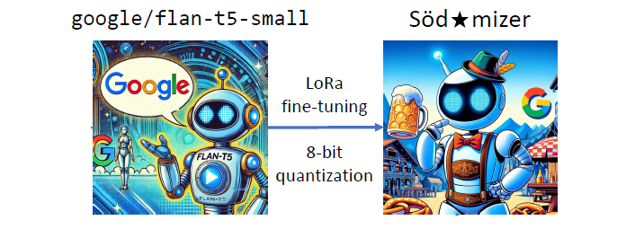

# Building the Söd★mizer: AI-Driven Machine Translation for Gender-Sensitive to Gender-Inclusive Language Transformation



## Table of contents
1. [Introduction](#introduction)  
2. [What is Gendering?](#what-is-gendering)  
3. [Project Naming](#project-naming)  
4. [Research Goals](#research-goals)  
5. [Usage](#usage)  
6. [Results](#results)  
7. [Contact](#contact)  


## Introduction  
Söd★mizer is an experimental machine translation system designed to convert gender-sensitive German texts into either generic masculine/feminine forms or explicitly gender-inclusive formulations. 

## What is Gendering?  
The discussion surrounding gender-sensitive language in German linguistics, politics, and society is highly controversial. At the center of the debate is the generic masculine—the use of male forms to refer to mixed or unspecified groups (Genderleicht, o. J.). While proponents of this language convention argue that it is gender-neutral, empirical studies show that this is not the case. For example, Braun, Sczesny, and Stahlberg (Braun et al., 2005) found that the generic masculine is primarily associated with men, which can reinforce cognitive biases and potentially gender-specific prejudices. In response, various strategies for gender-fair language have been developed, which are comprehensively discussed in linguistic guidelines (Diewald and Steinhauer, 2020).

There are several forms for gender-fair language; however, for the sake of simplicity, they are collectively referred to in this project as:
> 1. **Neutral form:** Neutralization of the substantive, e.g., Student:innen → Studierende (students)
> 2. **Generic masculine/feminine:** Adaptation to the respective context, e.g., Student:innen → Studenten or Studentinnen (male or female students)
> 3. Gender-inclusive form: Explicit mention of all genders, e.g., Student:innen → Studenten, Studentinnen und Personen an derer geschlechtlicher Identität, die an einer Hochschule studieren (male and female students and people of other gender identities studying at a university)


For further information, please refer to 1. Introduction in `building_the_soedermizer.pdf`.

## Project Naming  
The project is named "Söd★mizer," a play on the name of Bavarian Prime Minister Markus Söder, who has publicly opposed gender-sensitive language. The aim of this project is to develop an automated translator that removes gender forms from texts, thereby creating a "Söder-compliant" language. The choice of name highlights the satirical approach of the project: through deliberate exaggeration and particularly convoluted formulations, the debate is humorously exaggerated.

## Research Goals  
- **Goal 1:**  Implementing a simple proof-of-concept for the removal of gender forms using Google’s Flan-T5-small. This serves as a basis for evaluating the suitability of small language models for translation tasks in German. It involves the reduction of gender-sensitive special characters to generic masculine or feminine. For example: Die Student:innen sind sehr fleißig. → Die Studenten sind sehr
fleißig.
- **Goal 2:** Goal 2: Transforming gender-sensitive sentences into a gender-inclusive form. This is carried out in two steps: (A) Expanding an existing gold standard from [CorrelAid](https://github.com/CorrelAid/open-data-gender-sensitive-language/tree/main) using the OpenAI API to generate sentences with inclusive versions. (B) Fine-tuning Flan-T5-small on this new dataset to test whether smaller models can also perform such translations 

# Usage

## 1. Set Up the Environment  
1. **Create a virtual environment:**
    ```bash
    python -m venv .env
    ```

2. **Activate the virtual environment:**
    - On **Windows**:
        ```bash
        .\.env\Scripts\activate
        ```
    - On **Linux/MacOS**:
        ```bash
        source .env/bin/activate
        ```

3. **Install the dependencies:**
    ```bash
    pip install -r requirements.txt
    ```

## 2. Create Dataset (Failed Attempt)  
1. **Run the dataset script:**
    ```bash
    python dataset.py
    ```

**NOTE:** A Java 8 or higher installation is required for grammar correction using `language-tool-python`.

### Why this method failed  
The automated dataset creation approach failed due to several reasons:  

> "Upon manual inspection, it became apparent that the dataset contained various failure cases. Encoding artifacts were observed, leading to misinterpretations of special characters. Additionally, word omissions occurred, changing the intended meaning of sentences. One particularly problematic case was the unintended neutralization of words, where terms like *Regisseur* (director) were replaced with *Regie* (directing), leading to a shift in meaning from a person to an activity. As a result, this method proved insufficient for generating high-quality training data, necessitating the use of an alternative dataset."

As described in Section 3.3.1 in `building_the_soedermizer.pdf`, these issues rendered the generated dataset unsuitable, leading to the decision to utilize a curated gold-standard dataset instead.

## 3. Dataset Creation for Goal 1 + 2
1. **Run the preprocessing script:**
    ```bash
    python preprocessing.py
    ```

## 4. Train Model  
1. **Install PyTorch:**
    ```bash
    pip3 install torch --index-url https://download.pytorch.org/whl/cu124
    ```
    **NOTE:** Ensure you select the correct CUDA version. Refer to the [PyTorch documentation](https://pytorch.org/get-started/locally/) for more details.

2. **Start Training:**
    ```bash
    python training.py
    ```

## 5. Model Evaluation  
1. **Generate Predictions:**
    ```bash
    python evaluation.py
    ```
2. **Analyze Results:**
    ```bash
    python analysis_results.py
    ```


# Results  
Manual evaluations were performed for determining the translation success rate. Please look into `manual_evaluation.xlsx` contained in the respective `experiments/<SELECT GOAL>/results/output/`-folders for the manually evaluated results.  

> "The experiments showed that the Söd★mizer system achieved a weighted translation success rate of 92.7% when tasked with converting gender-sensitive text into the generic masculine or feminine forms. However, certain recurring failure cases—such as encoding artifacts, word omissions, and unintended neutralizations—were identified and remain areas for improvement. When generating explicitly gender-inclusive formulations, the model’s performance was significantly lower, with only 32% of outputs being semantically correct. While the model effectively applied syntactic transformations, it struggled with contextual coherence and precision, suggesting a need for future refinements such as enhanced prompt engineering, constrained decoding techniques, and domain-specific fine-tuning."

For a more comprehensive analysis, please refer to the detailed report at `building_the_soedermizer.pdf`.


# Contact  
For any additional questions or comments, please contact me at dennis.mustafic@fau.de
